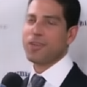
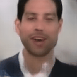

|   |||
|:-:|:-:|:-:|
||||

# Controllable Face Generation via Conditional Adversarial Latent Autoencoder (ALAE)

**Authors**: Grigorii Sotnikov, Vladimir Gogoryan, Dmitry Smorchkov and Ivan Vovk (all have equal contribution)

The work has been done as the Deep Learning Course final project "Controllable Face Generation via Conditional Latent Models" at Skoltech. You can check the report and details in `demo/paper.pdf`.

## Info

This master branch contains the solution for facial keypoints transfer (chech another branches for other types of conditions and approaches) based on publicly available pretrained generative model Adversarial Latent Autoencoder (ALAE, https://github.com/podgorskiy/ALAE). The solution is simple and just manipulates the latent codes of images by a small mapping MLP network. Generally, the whole pose-transfer architecture is trained adversarially with a special MLP critic network just on the latent codes of ALAE.

It is worth to mention, that ALAE has a huge identity gap during real image restoration. So if you encode the image and then decode it with the generator, than you'll get a similar high-end quality picture, but the human identity will be not the same. In order to overcome it, we parametrically finetune ALAE's generator on a new face using perceptual VGG19 loss.

## Reproducibility

First of all, make sure you have installed all the python packages by `pip install -r requirements.txt`. To try the solution we prepared `notebooks` folder, where we provided finetunning and inferene codes.

## Data and trained models

The whole model is trained on the single speaker (id00061) from VoxCeleb2 dataset. Dataset is available at [this](https://drive.google.com/drive/folders/1T26YUSpa1RqU9mhgQhJj9M5jA3nDfZoV?usp=sharing) link. Here you can also find the pretrained model `face_rotation_model.pt`. Put it `checkpts` folder and run notebooks.

## Our ALAE implementation and another latent attributes manipulation experiments

Switch the branches of the repository for another experiments. We implemented our own ALAE solution and successfully trained it up to 64x64 resolution. You can find it in the branch `alae-implementation`. Also instead of facial keypoints we tried to condition the latent space mapping network with other CelebA class attributes. This experiments were done with ACAI-based (https://arxiv.org/pdf/1807.07543.pdf) encoder-decoder network.
